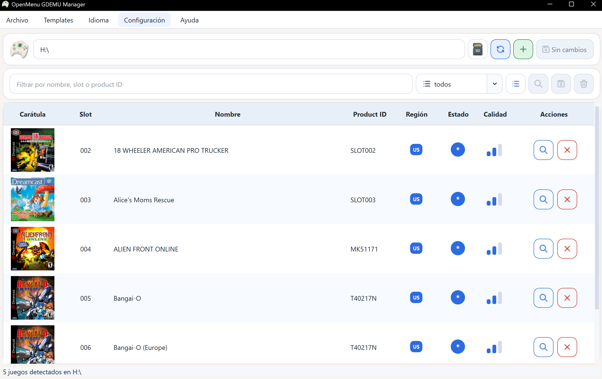
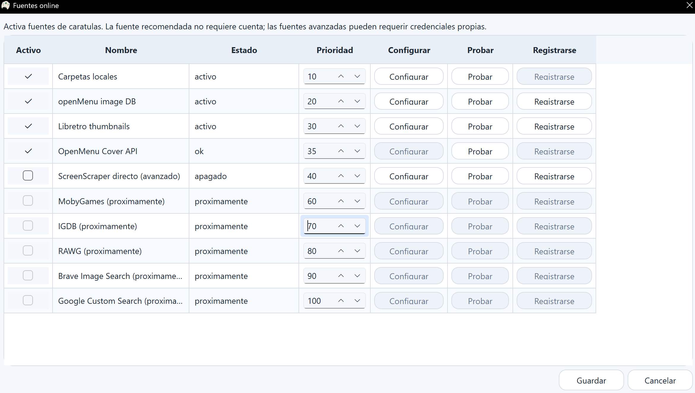

<p align="center">
  
</p>

# OpenMenu GDEMU Manager (OGM)

[Español](README.es.md)

Portable Windows desktop app for preparing and managing Dreamcast GDEMU/OpenMenu SD cards and local backups.

The app can scan a GDEMU/OpenMenu structure, add or remove games, compact slot folders, rebuild the OpenMenu menu, sync cover art, and apply changes only after a safety diagnostic allows writing.

## Status

Public beta. The main SD workflow has been tested on real Dreamcast/GDEMU hardware, including large add/remove/cover operations, but users should still keep backups and review the diagnostic before applying changes to an SD card.

This repository does not include ROMs, BIOS files, commercial game data, SD backups, official Sega assets, or private API credentials.

## Download

Download the latest portable Windows ZIP from [GitHub Releases](https://github.com/OlemOdracir/openmenu-gdemu-manager/releases).

Extract the ZIP and run `OpenMenuGDEMUManager.exe`. The app stores settings, logs, cache and generated files in the portable `data/` folder next to the executable.

This beta is not digitally signed. Windows SmartScreen may show a warning the first time it is opened.

## Screenshots

### Main Window



### Online Cover Sources



## What It Does

- Detects GDEMU/OpenMenu SD structures and local backups.
- Installs an OpenMenu base into a clean FAT32 SD using bundled OpenMenu menu assets.
- Adds GDI/CDI games into numbered slots.
- Marks games for removal and moves them to an internal SD trash folder instead of deleting them immediately.
- Compacts physical game folders from `02` upward so OpenMenu does not show empty slots.
- Rebuilds the OpenMenu folder `01` with `buildgdi.exe` instead of patching a fixed block inside `track05.iso`.
- Updates `OPENMENU.INI` and preserves/syncs OpenMenu cover DAT files.
- Reads existing covers from the SD menu DAT files after scanning.
- Keeps a lightweight SD registry in `_openmenu_gdemu_manager/` with backup and transaction information.
- Supports Spanish and English UI.

## Important Safety Notes

This beta does not format SD cards and does not intentionally delete games during normal save operations. Removed games are moved to:

```text
_openmenu_gdemu_manager/trash/
```

The app also creates a technical backup of folder `01` before replacing the OpenMenu menu. A full SD backup is optional, but strongly recommended before large operations such as adding, removing, or compacting many games.

Do not unplug the SD card or turn off the PC while the app is applying changes.

## License

OpenMenu GDEMU Manager is licensed under the GNU General Public License v3.0 or later. See [LICENSE](LICENSE).

## Run From Source

Requirements:

- Windows
- Python 3.11 or newer

```powershell
py -m pip install -e ".[dev]"
py -m openmenu_gdemu_manager
```

For local development:

```powershell
py -m pytest
```

## Portable Windows Build

To create a portable build:

```powershell
$Version = "0.2.0-beta.3"
.\scripts\build_portable.ps1 -Version $Version
```

The output is written to `dist/`:

- `OpenMenuGDEMUManager-Portable/`
- `OpenMenuGDEMUManager-0.2.0-beta.3-portable-windows.zip` when using the example above

Portable users should run `OpenMenuGDEMUManager.exe`. The executable keeps settings, logs, cache and generated files inside the portable folder.

## Updates

On startup, the app checks the latest GitHub release. If a newer version is available, it shows a prompt and opens the release page so the user can download the new portable ZIP.

The app does not overwrite or self-replace its executable.

## Safe Diagnostics

Before scanning or writing, the selected path is classified. Write actions are enabled only for a compatible OpenMenu/GDEMU structure or a local backup that passes validation.

The app blocks writing for:

- internal drive roots
- paths that do not look like GDEMU/OpenMenu storage
- removable drives that are not FAT32
- paths with possible corruption markers

The app does not format drives, repair filesystems, or run `chkdsk`.

## OpenMenu Rebuild Engine

The app rebuilds the OpenMenu menu using a bundled third-party `buildgdi.exe` tool from GDIbuilder, with license notices in [THIRD_PARTY_NOTICES.md](THIRD_PARTY_NOTICES.md). This is preferred over modifying `track05.iso` in place because OpenMenu data can grow beyond the original fixed block.

The optional "Install OpenMenu base" action builds folder `01` from bundled OpenMenu menu assets and `buildgdi.exe`. If `openmenu_setup.template_dir` contains a prebuilt `01`, that folder is still accepted as a compatibility override.

## Cover Sources

Default safe sources are local folders, openMenu image DB data, Libretro thumbnails, and the OpenMenu Cover API proxy. The proxy does not require user accounts and does not expose third-party developer credentials to the desktop app.

Advanced direct providers such as ScreenScraper can be configured locally by users who want to use their own credentials. Other API providers are reserved for future versions.

Manual Google/Bing/DuckDuckGo image searches open in the browser. The app does not scrape those sites automatically.

## Runtime Data

Runtime data is kept outside the repo by default, under the app data directory, or inside the portable folder when using the portable executable.

Common generated files include:

- settings: `cover_sources.json`
- state: `_cover_manager_state.json`
- logs: `openmenu_gdemu_manager.log`
- staged covers: `_cover_inbox/`
- reports: `cover_report.tsv`, `cover_report.json`
- SD registry: `_openmenu_gdemu_manager/backup_registry.json`
- SD transaction log: `_openmenu_gdemu_manager/transactions.jsonl`

These files should not be committed.

## Beta Limits

- The app does not include games, BIOS files, commercial game data, or SD card images.
- It bundles minimal GPL OpenMenu base assets used only to prepare folder `01`.
- The app does not format SD cards.
- The app is unsigned; Windows SmartScreen may warn on first run.
- Direct ScreenScraper support requires the user's own credentials.
- Public API integration tests are skipped by default and only run when `OPENMENU_RUN_INTEGRATION=1` is set.

## Third-party Notices

See [THIRD_PARTY_NOTICES.md](THIRD_PARTY_NOTICES.md).

## Contact

Project contact: [GitHub Issues](https://github.com/OlemOdracir/openmenu-gdemu-manager/issues)
